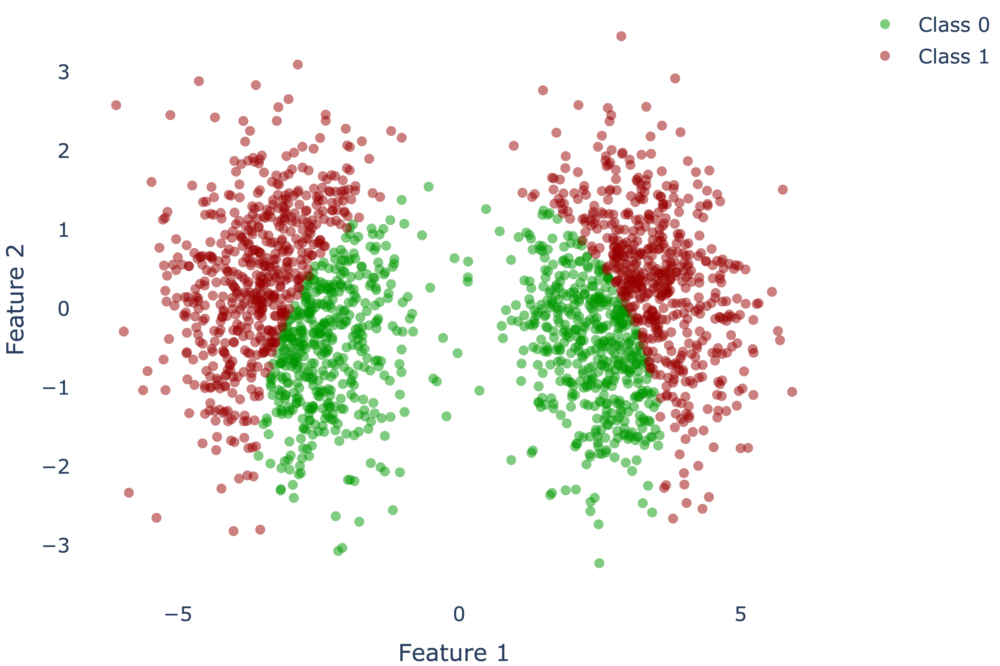
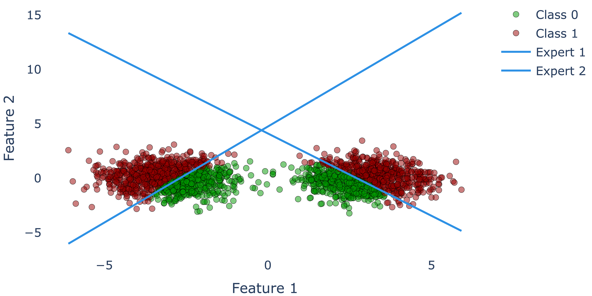

```python
import math

import torch
import torch.nn as nn
import torch.nn.functional as F
from torch.utils.data import Dataset

import numpy as np
import matplotlib.pyplot as plt

from tqdm import tqdm
```


```python
# Generate the Dataset
def generate_data(n_samples=1000):
  X = torch.zeros(n_samples, 2)
  y = torch.zeros(n_samples, dtype=torch.long)

  # Generate samples from two Gaussian distributions
  X[:n_samples//2] = torch.randn(n_samples//2, 2) + torch.Tensor([3,2])
  X[n_samples//2:] = torch.randn(n_samples//2, 2) + torch.Tensor([-3,2])

  # Labels
  for i in range(X.shape[0]):
    if X[i].norm() > math.sqrt(13):
      y[i] = 1

  X[:, 1] = X[:, 1] - 2

  return X, y

data, labels = generate_data()
```


```python
class_0 = data[labels == 0]
class_1 = data[labels == 1]

plt.scatter(class_0[:, 0], class_0[:, 1], label='Class 0', alpha=0.5)
plt.scatter(class_1[:, 0], class_1[:, 1], label='Class 1', alpha=0.5)

plt.xlabel('Feature 1')
plt.ylabel('Feature 2')
plt.legend()

plt.show()
```


    

    


## Expert Model

Let's implement the Expert model. It will be a simple neural network with one linear layer.


```python
class Expert(nn.Module):
  def  __init__(self, input_size, output_size): 
    super(Expert, self).__init__()
    self.linear = nn.Linear(input_size, output_size)
    
  def forward(self, data):
    x = self.linear(data)
    return x
```

## Gating Network

Now, let's implement the Gating Network. The Gating Network will output the probabilities for choosing each expert.


```python
class GatingNetwork(nn.Module):
  def __init__(self, input_size, num_experts):
    super(GatingNetwork, self).__init__()
    self.linear1 = nn.Linear(input_size, 4)
    self.relu = nn.ReLU()
    self.linear2 = nn.Linear(4, num_experts)
    self.softmax = nn.Softmax(dim=-1)
  
  def forward(self, data): 
    x = self.linear1(data)
    x = self.relu(x)
    x = self.linear2(x)
    x = self.softmax(x)
    return x
```

## Mixture of Experts

Finally, let's implement the Mixture of Experts model. This model will utilize the Expert and Gating Network models to make a final prediction.


```python
class MixtureOfExperts(nn.Module):
  def __init__(self, num_experts=2):
    super(MixtureOfExperts, self).__init__()  
    self.expert1 = Expert(2,1)
    self.expert2 = Expert(2,1)
    self.gating =  GatingNetwork(2, num_experts)
    self.sigmoid = nn.Sigmoid()
      
  def forward(self, data):
    expert1_output = self.expert1(data)
    expert2_output = self.expert2(data)  
    
    gating_output =  self.gating(data)

    s = (expert1_output*gating_output[:,0][:,None] + 
         expert2_output*gating_output[:,1][:,None])
    
    a = self.sigmoid(s)
    
    return a

  def backward(self, y_hat, labels, criterion, optimizer): 
    optimizer.zero_grad()
    loss = criterion(y_hat, labels)    
    loss.backward()
    optimizer.step()
    return loss.item()
```

## Training Loop


```python
# Define the model, loss, and optimizer
moe = MixtureOfExperts()
criterion = nn.MSELoss() 
optimizer = torch.optim.Adam(moe.parameters(),lr=0.01)

# Convert data and labels to float tensors
data_tensor = data.float()
labels_tensor = labels.view(-1, 1).float()

# Training loop
num_epochs = 500 
for epoch in tqdm(range(num_epochs)):
    # Forward pass
    y_hat = moe.forward(data)

    # Backward pass and optimization
    loss_value = moe.backward(y_hat, labels_tensor, criterion, optimizer)
```

    100%|███████████████████████████████████████| 500/500 [00:00<00:00, 1325.75it/s]


## Decision Boundaries

Finally, let's plot the decision boundaries of the two experts, the gating network and the final model.


```python
w11 = moe.expert1.linear.weight[0][0].detach()
w12 = moe.expert1.linear.weight[0][1].detach()

w21 = moe.expert2.linear.weight[0][0].detach()
w22 = moe.expert2.linear.weight[0][1].detach()

b1 = moe.expert1.linear.bias.detach()
b2 = moe.expert2.linear.bias.detach()
```


```python
x_range = np.linspace(min(data[:,0]), max(data[:,0]))

y_line1 = -(w11 * x_range + b1) / w12 + 2.5
y_line2 = -(w21 * x_range + b2) / w22 + 2.5

class_0 = data[labels == 0]
class_1 = data[labels == 1]
```

```python
plt.scatter(class_0[:, 0], class_0[:, 1], label='Class 0', alpha=0.5)
plt.scatter(class_1[:, 0], class_1[:, 1], label='Class 1', alpha=0.5)

plt.plot(x_line, y_line1, label='Expert 1', alpha = 1)
plt.plot(x_line, y_line2, label='Expert 2', alpha = 1)

plt.xlabel('Feature 1')
plt.ylabel('Feature 2')
plt.grid(True, c='gray')
plt.legend()
plt.autoscale()
plt.show()
```


    

    
